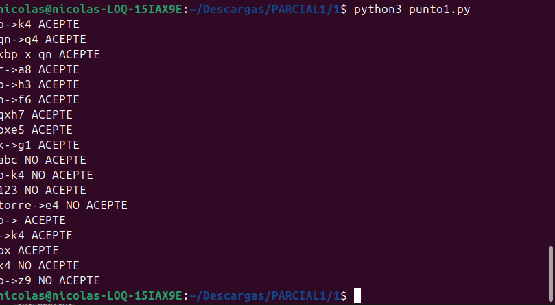
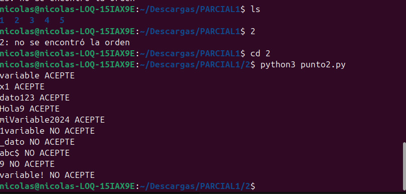
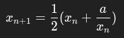
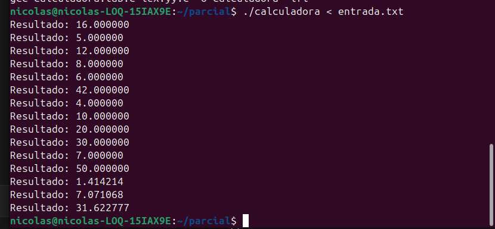
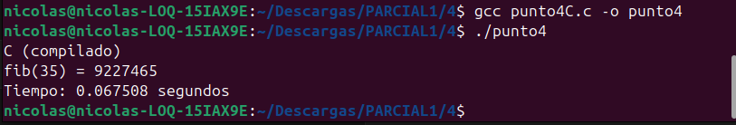
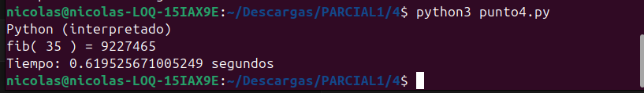
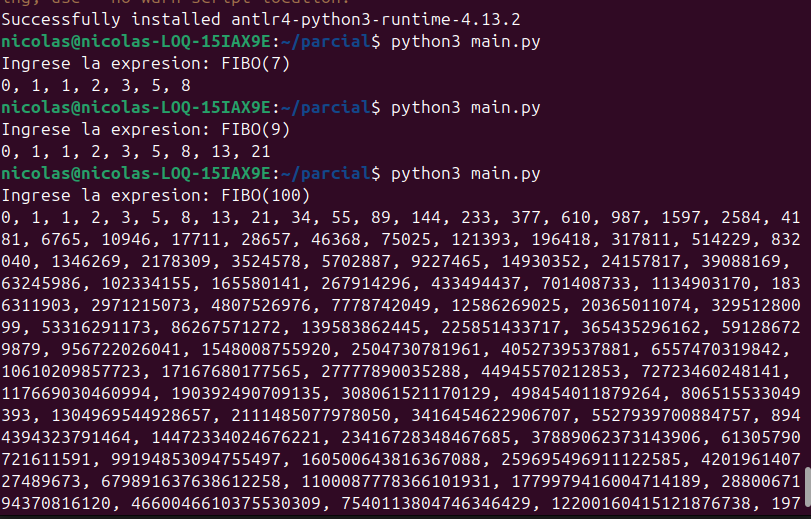

# PARCIAL--1--LENGUAJES


**INTRODUCCION**

En este parcial se desarrollaron diferentes ejercicios relacionados con conceptos fundamentales de los lenguajes de programación, autómatas y herramientas de construcción de compiladores. Cada punto aborda una temática distinta, como el reconocimiento de cadenas mediante autómatas, validación de identificadores, uso de herramientas como Flex y Bison para construir un analizador y el uso de ANTLR para el procesamiento de expresiones.

El objetivo principal del trabajo fue aplicar estos conceptos mediante programas funcionales que puedan ejecutarse desde consola en un entorno Linux. Cada punto fue implementado utilizando el lenguaje o herramienta solicitada, permitiendo observar el funcionamiento práctico de los temas vistos en clase.

**Punto 1 – Reconocimiento de movimientos de ajedrez**

ANALISIS

En este punto se desarrolló un programa en Python que permite validar cadenas que representan movimientos de ajedrez escritos en una forma simplificada. Para ello se implementó una función que analiza cada cadena y verifica que cumpla con el formato esperado, por ejemplo movimientos como p->k4 o capturas como pxe5.

El programa revisa que las piezas utilizadas pertenezcan al conjunto válido de piezas del ajedrez y que el destino del movimiento esté compuesto por caracteres permitidos como letras del tablero o números de posición. Si la cadena cumple estas condiciones el programa indica que la cadena es aceptada, en caso contrario se rechaza.

Las jugadas a evaluar se leen desde un archivo de texto, lo cual permite probar fácilmente múltiples ejemplos de entrada.

**RESULTADOS**

Se realizaron pruebas con diferentes cadenas que representan movimientos de ajedrez. El programa logró aceptar correctamente los movimientos válidos como p->k4 o pxe5 y rechazar cadenas que no cumplían con el formato definido.



COMO EJECUTARLO

Ejecutar punto 1

```bash
python3 punto1.py
```

El programa leerá las jugadas desde el archivo entrada.txt.

**Punto 2 – Validación de identificadores***

ANALISIS

En este ejercicio se implementó un programa que valida identificadores siguiendo una expresión regular típica utilizada en lenguajes de programación. La regla utilizada establece que un identificador debe comenzar con una letra y posteriormente puede contener letras o números.

El programa analiza cada cadena de entrada y verifica estas condiciones carácter por carácter. Si el primer carácter no es una letra el identificador es rechazado inmediatamente. Luego se revisa el resto de la cadena para confirmar que solo contenga caracteres válidos.

Las cadenas de prueba se leen desde un archivo de texto, permitiendo verificar varios ejemplos válidos e inválidos.

**RESULTADOS**

Se probaron diferentes cadenas para verificar si cumplían con las reglas de un identificador. El programa aceptó correctamente identificadores válidos como variable o dato123, y rechazó entradas inválidas como 1variable o abc$.



COMO EJECUTARLO

```bash
python3 punto2.py
```

Punto 3 – Calculadora con Flex y Bison
Análisis

En este punto se desarrolló una calculadora simple utilizando las herramientas Flex y Bison. Flex se encarga de realizar el análisis léxico identificando tokens como números, operadores y la función sqrt. Por su parte Bison se encarga de analizar la estructura de las expresiones y realizar las operaciones correspondientes.

Para el cálculo de la raíz cuadrada se implementó el método numérico de Newton-Raphson, el cual permite aproximar la raíz cuadrada de un número mediante iteraciones sucesivas. Este método se basa en la fórmula:


El programa recibe expresiones desde un archivo de texto y muestra los resultados de cada operación en la consola.

**RESULTADOS**

Se probaron distintas expresiones matemáticas desde un archivo de entrada. El programa ejecutó correctamente operaciones básicas y el cálculo de raíz cuadrada utilizando el método de Newton-Raphson.



COMO EJECUTARLO

Primero se debe compilar el programa utilizando Flex y Bison.

```bash
make
```

Luego se ejecuta con el archivo de entrada:

```bash
./calculadora < entrada.txt
```
**Punto 4 – Comparación entre lenguaje compilado e interpretado**

ANALISIS

En este punto se realizó una comparación entre un lenguaje compilado y uno interpretado mediante la implementación de una función recursiva para calcular la serie de Fibonacci. El programa fue desarrollado tanto en C como en Python.

El objetivo fue observar la diferencia en el tiempo de ejecución entre ambos lenguajes. El programa en C debe ser compilado antes de ejecutarse, mientras que el programa en Python se ejecuta directamente mediante el intérprete.

Al ejecutar ambos programas se puede observar que el lenguaje compilado suele presentar tiempos de ejecución menores, lo que demuestra una de las ventajas de los lenguajes compilados en términos de rendimiento.

**RESULTADOS**

Se ejecutó el algoritmo de Fibonacci en C y en Python. Los resultados mostraron que el programa compilado en C se ejecuta más rápido que el programa interpretado en Python.


EJECUCION C



EJECUCION PY



COMO EJECUTARLO

Compilar el programa en C:

```bash
gcc punto4C.c -o punto4
```
Ejecutar el programa compilado:
```bash
./punto4
```

Ejecutar la versión en Python:

```bash
python3 punto4.py
```

Punto 5 – Secuencia de Fibonacci con ANTLR

ANALISIS

En este ejercicio se desarrolló un pequeño lenguaje utilizando ANTLR que permite reconocer expresiones del tipo FIBO(n). La gramática definida valida que la expresión tenga la estructura correcta y extrae el valor numérico indicado.

Una vez validada la entrada, el programa en Python genera la secuencia de Fibonacci hasta el número indicado. Finalmente la secuencia es mostrada en consola separada por comas.

Este ejercicio permite observar el uso de ANTLR para definir gramáticas y procesar expresiones de entrada.

**RESULTADOS**

El programa reconoció correctamente expresiones como FIBO(n) y generó la secuencia de Fibonacci correspondiente, mostrando los resultados en consola.



COMO EJECUTARLO

Generar los archivos de ANTLR:

```bash
 java -jar antlr-4.13.1-complete.jar -Dlanguage=Python3 Fibo.g4
```
Ejecutar el programa:

```bash
python3 main.py
```
Luego ingresar una expresión como:

FIBO(7)


**CONCLUSION**

En este parcial se aplicaron diferentes conceptos relacionados con lenguajes de programación y herramientas de análisis de código. A través de los ejercicios se pudo trabajar con validación de cadenas, reconocimiento de patrones, construcción de analizadores con Flex y Bison, y definición de gramáticas utilizando ANTLR.

Los resultados obtenidos muestran que cada uno de los programas desarrollados cumple con la funcionalidad solicitada, permitiendo procesar correctamente las entradas y generar los resultados esperados. Además, el ejercicio de comparación entre lenguajes compilados e interpretados permitió observar diferencias importantes en el rendimiento.

En general, el desarrollo de este trabajo permitió reforzar la comprensión práctica de los temas vistos en clase y el uso de herramientas utilizadas en el diseño y construcción de lenguajes y compiladores.
